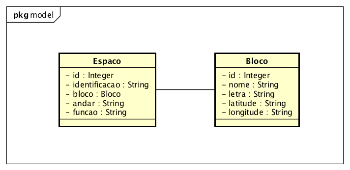
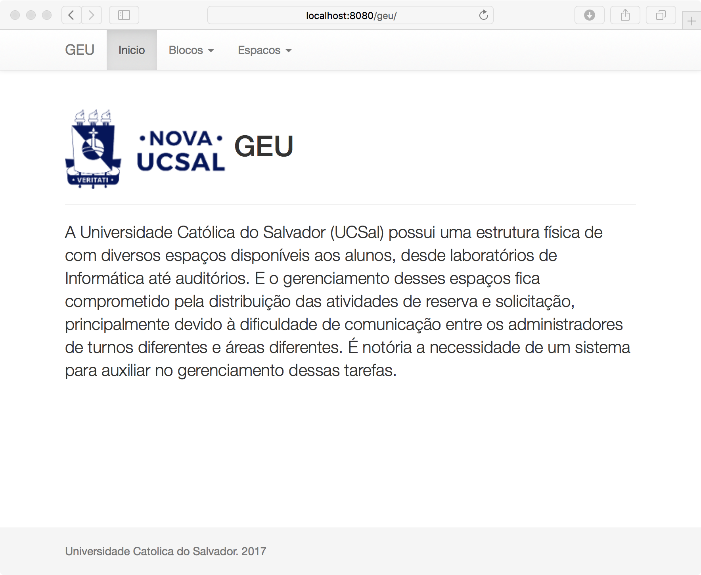
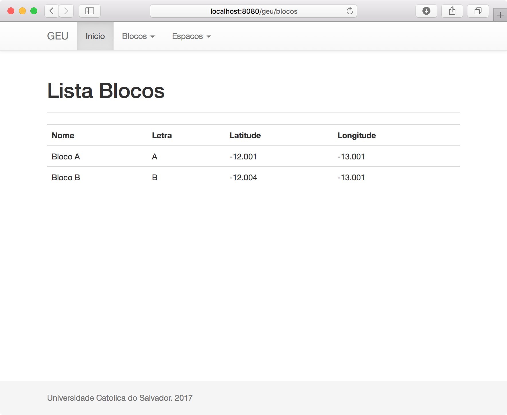
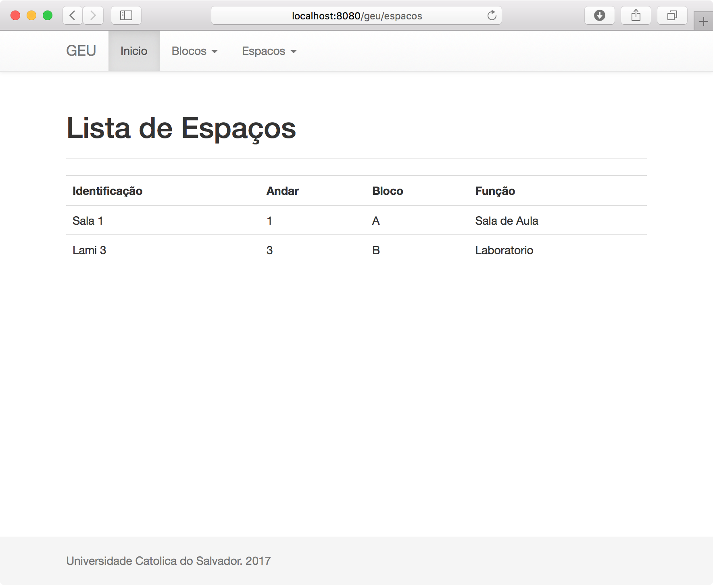
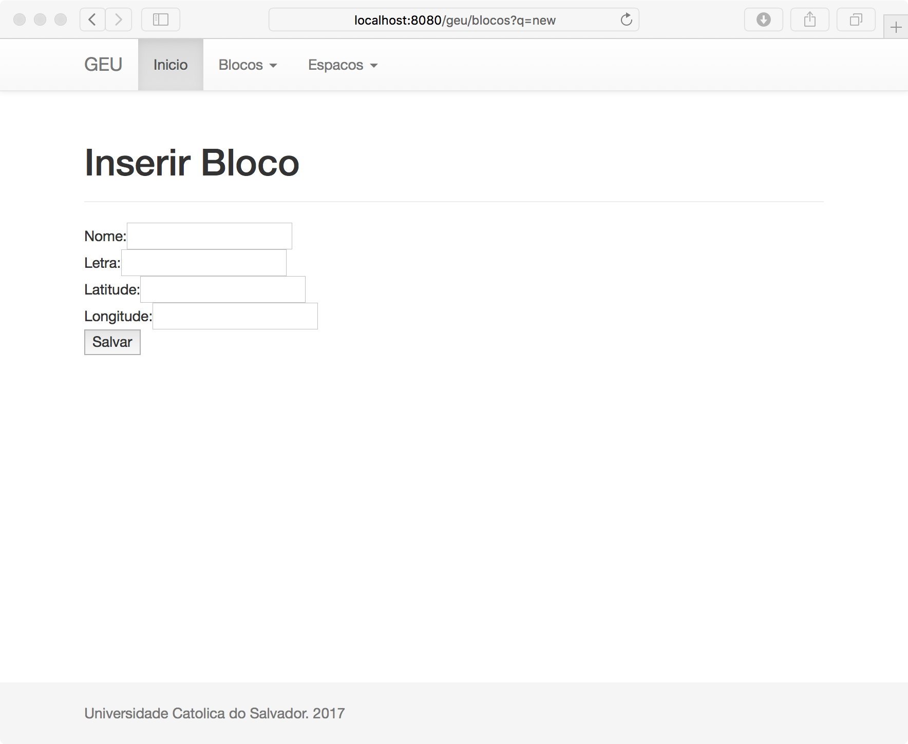
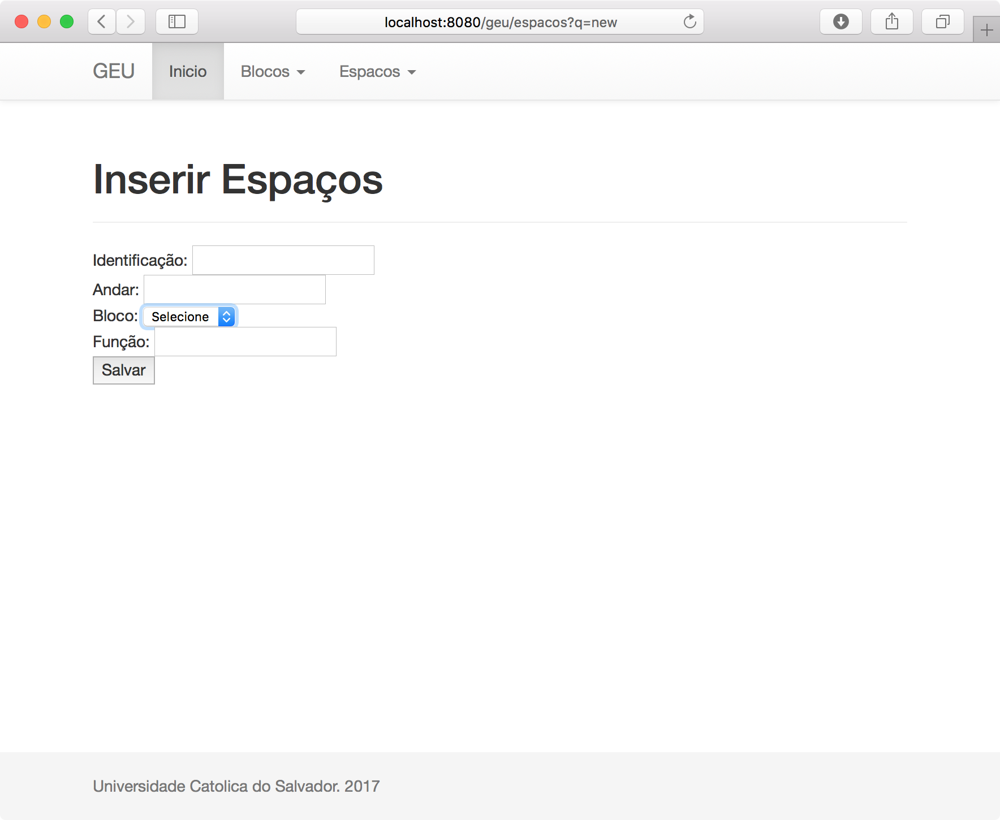
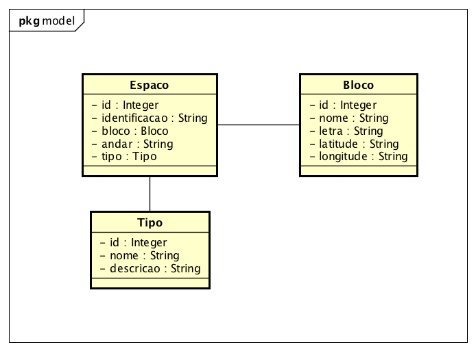

# GEU - GERENCIADOR DE ESPAÇOS UNIVERSITÁRIOS

## VERSÃO SIMULADO:

O código apresenta apenas o conteúdo visto na AVI:
* HTML
* CSS
* JavaScript
* Java
* JavaScript
* JSP
* JDBC

O projeto esta no Eclipse e esta usando o banco de dados HSQLDB em memória. Não há nenhuma necessidade de alterar a classe __Conexao.java*__

*` Caso deseje altera é por sua conta e risco. `

Para atender aos requisitos de mapeamento de espaços da universidade a primeira versão foi desenvolvida com base no diagrama de classes.

Atualmente o sistema está executando, inserindo e listando Espaços e Blocos. AS telas do Sistema como estão funcionando:

## ALTERAÇÕES NECESSÁRIAS

Ao apresentar ao usuário ele identificou a necessidade de classificar os espaços por função, no entanto por conta do campo aberto ficou difícil classificar.

A solução foi alterar o campo função aberto por um *combobox* para classificar o tipo de espaço.

Sua função é alterar o atributo 'função' do Espaço, ele vai deixar de existir. Pois deve ser criada uma nova entidade chamada Tipo que vai ter um ID, NOME, DESCRIÇÃO.

Estude o código existente:

Adicione os seguintes arquivos:

* Tipo.java
* TipoDAO.java
* TipoController.java
* tipolist.jsp
* tipoform.jsp

Altere:

* espacoform.jsp
* espacolist.jsp
* EspacoController.Java
* EspacoDAO.java

Para usar o novo esquema do banco basta remover o trecho comentado com VERSAO 2 e comentar ou apagar o trecho da VERSAO 1.
